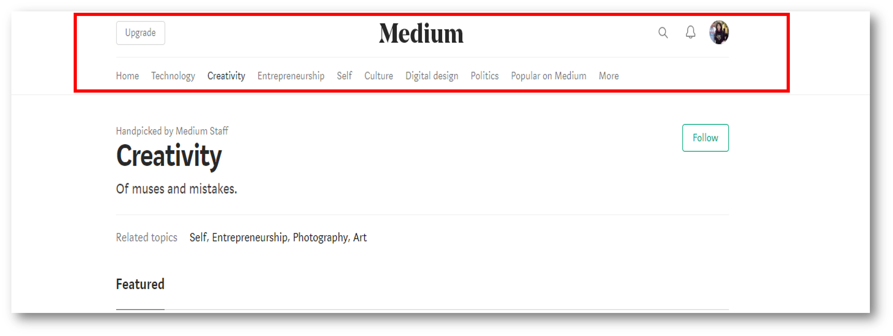
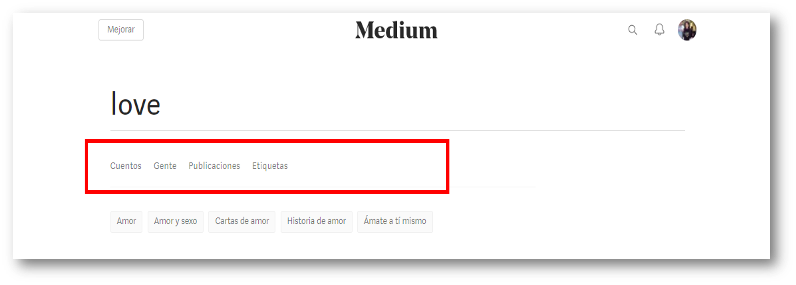
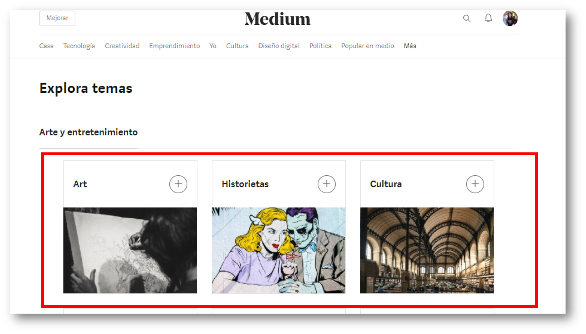
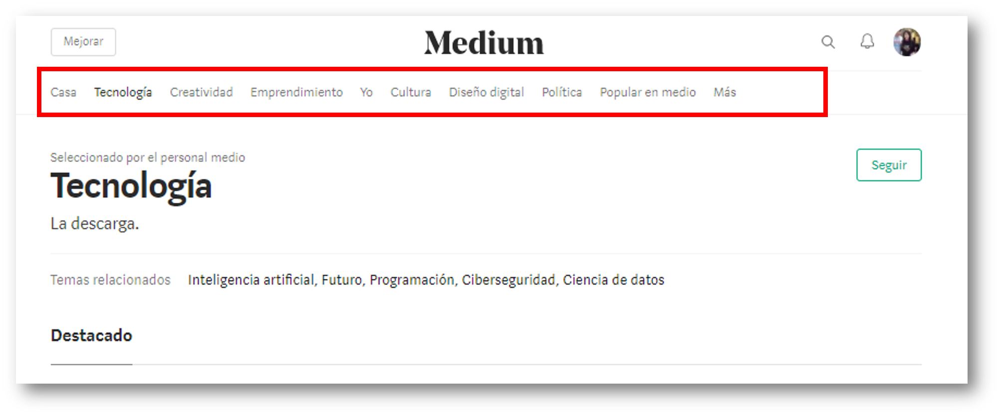
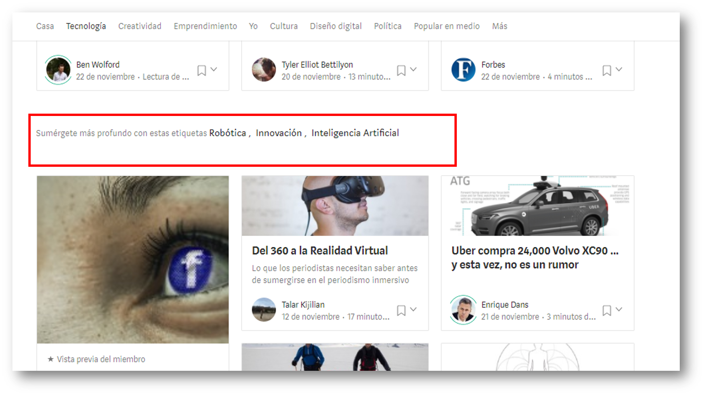
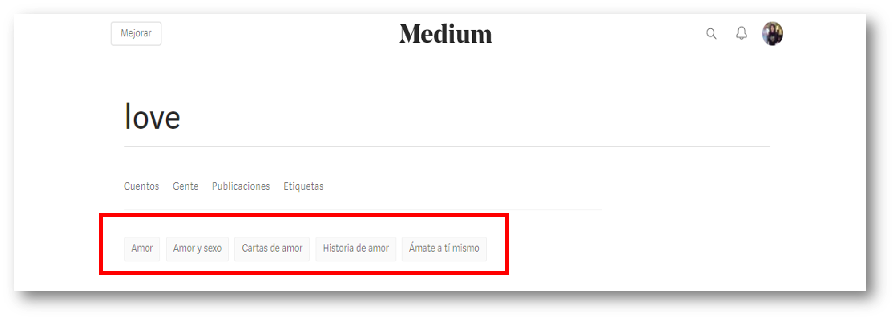
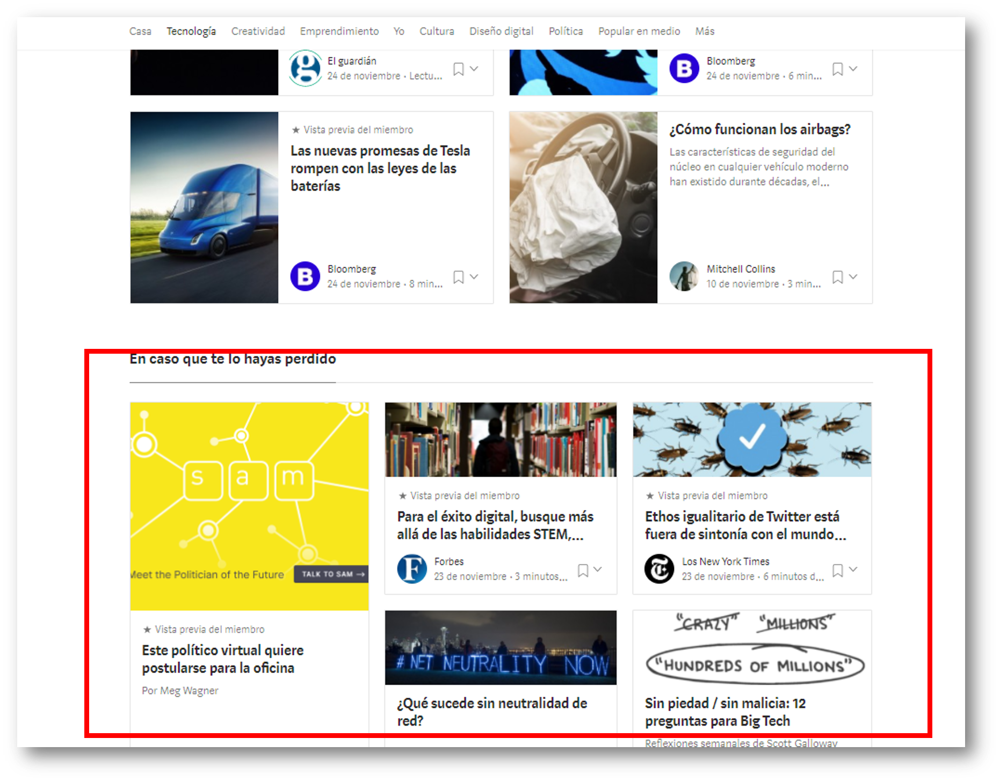
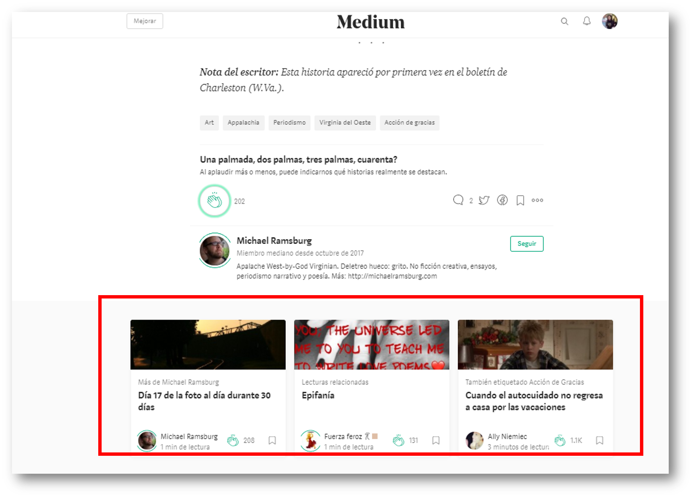
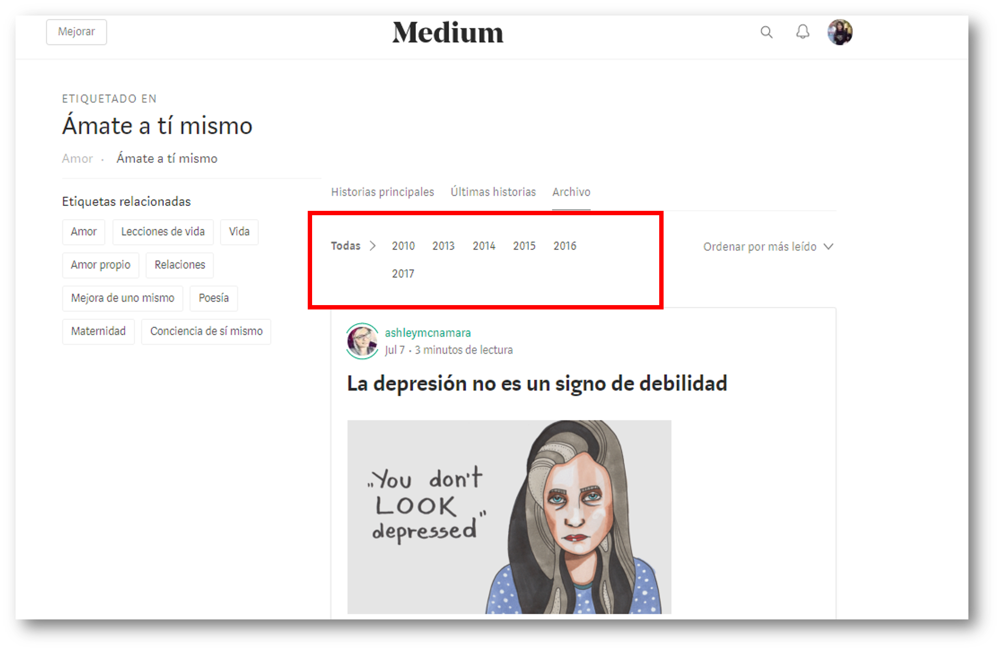

# MEDIUM (elementos de navegación)

* **Curso:** _Creando tu primer sitio web interactivo_
* **Unidad:** _Intro a User Experience Design_

## Objetivo

Identificar los elementos de navegación de la wesite **Medium**.

## Alumna
* Maria Cristina Ortiz Villafuerte.

## Descripción

Se muestra la identificación de los elementos de navegación de la wewbsite **Medium**:

### Navegación global

### Navegación local

### Navegación local-facetada

Se identificó que la parte seleccionada es navegación local porque como página interna tienen su propia navegación que ayuda al usuario a explorar esa vista en particular; y facetada, porque la navegación es a través de filtro, pero estos no son editables, sino estan definidos previamente por el sistema.

### Navegación facetada

### Navegación contextual

### Navegación filtrada

